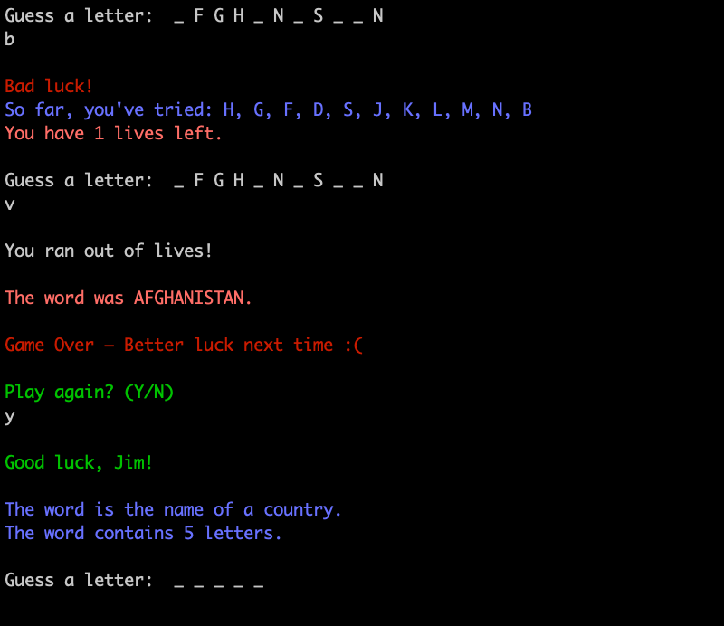

# Hangman
By Jim Farrugia and Natasha Khatri

### GitHub Repository
https://github.com/Jimfarrugia/ruby_hangman

### Description
Hangman is an educational word guessing game to be played in a command-line interface. The game has been created with Ruby.

### Purpose
The purpose of Hangman is to provide a fun way of learning vocabulary and testing your general knowledge. This is done by allowing the user to guess the secret word one letter at a time, which can also be helpful for remembering the spelling of new words.

### Functionality
- Start program
- Program greets the user.
- Program prompts user for input if they want to play
    - If user enters "No", program exits
    - If user enters "Yes, program continues
- Prompts user for username, if nothing entered defaults to "Player"
- Program randomly generates a word for user to guess
- Prompts the user for input of a letter
- Checks user input
    - If correct, displays letter in secret word
    - If incorrect, displays number of lives left
- User input will loop until:
    - All letters are matched in the secret word
        - If true, then will display the secret word and victory screen
    - There are 0 lives left
        - If true, then will display the secret word and game over screen
- Prompts user if they want to play again
    - If user enters "No", program exits
    - If user enters "Yes", program will return with new word for user to guess

### Instructions for Use
1. Ensure your working directory is in the Hangman app root folder. 
2. In the command-line, enter `ruby ./src/index.rb` - this will load the welcome message and instructions on how to play 
3. Enter yes or no if you would like to play the game.
4. If you enter yes, the program will ask you to enter a username.
5. You will see a number of lines `_ _ _ _ _` that represent the number of letters in the word you have to guess.
6. Guess what the word is by entering one letter at a time.
4. Each correct letter will be revealed in the word.
5. For each incorrect guess, you will lose a life. You only get 7 lives.
6. Once you have finished the game, the program will prompt you for a yes or no if you would like to play again.

### Screenshots
Welcome screen
  

Choosing not play
  

Guess a letter
  

Incorrect guess
  

Inputs for guessing
  

Guessing word
  

Game over screen
  

Game Over and Choosing not to play again
  

Game Over and Choosing to play again
  

Winner screen
  

Winner and Choosing not to play again
  

Winner and Choosing to play again
  

### Design & Planning Process
##### Evidence of App Idea Brainstorming Sessions
  
  

##### User/Workflow Diagram

##### Project Plan & Timeline
[Project Plan and Timeline document](./docs/project_plan_and_timeline.pdf)  
[Initial pseudocode and text content for app](./docs/pseudocode_and_text_content.pdf)

##### Screenshots of Trello Board
  
