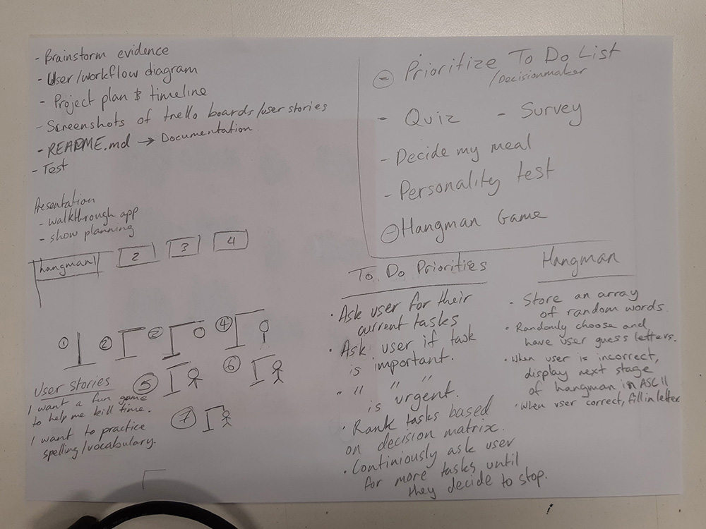

# Hangman
By Jim Farrugia and Natasha Khatri

### GitHub Repository
[GitHub Repo](https://github.com/Jimfarrugia/ruby_hangman)

### Description
Hangman is an educational game to be played in a command-line interface.

### Purpose
The purpose of the game is to allow the user to guess letters one at a time to solve what the secret word is. 

### Functionality
- Start program
- Program greets the user.
- Program prompts user for input if they want to play
    - If user enters "No", program exits
    - If user enters "Yes, program continues
- Prompts user for username, if nothing entered defaults to "Player"
- Program randomly generates a word for user to guess
- Prompts the user for input of a letter
- Checks user input
    - If correct, displays letter in secret word
    - If incorrect, displays number of lives left
- User input will loop until:
    - All letters are matched in the secret word
        - If true, then will display the secret word and victory screen
    - There are 0 lives left
        - If true, then will display the secret word and game over screen
- Prompts user if they want to play again
    - If user enters "No", program exits
    - If user enters "Yes", program will return with new word for user to guess

### Instructions for Use
1. Ensure your working directory is in the Hangman app root folder. 
2. In the command-line, enter `ruby ./src/index.rb`
3. This will bring up the Welcome message and How To Play instructions
3. Guess what the word is by suggesting one letter at a time.
4. Each correct letter will be revealed in the word.
5. For each incorrect guess, you will lose a try.
6. You only get 7 tries.

### Screenshots

### Design & Planning Process
##### Evidence of App Idea Brainstorming Sessions

##### User/Workflow Diagram

##### Project Plan & Timeline

##### Screenshots of Trello Board

